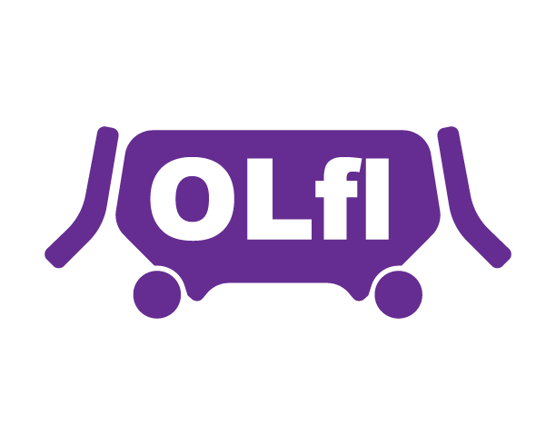

# PLEASE READ THIS BEFORE CONTINUING ON

**AT THE MOMENT, THIS DOES NOT WORK..**

Still in development so come back later to see a native build come out, its first going to be on Arch since I develop on it, and then comes the other distros.

Performance will be very poor, since its in its early stage, so come here to submit a issue from a certain game/VR tool and try and commit to this repo.
This may or may not be built in Rust or C/C++, I just gotta decide on which one I want to do. Also a Discord Server is coming soon!

*note: this may be packaged as a flatpak in order for every else to use it, but im not sure if the whole thing will work smoothly. Mainly expect Arch to be the most stable, and be weary of the other distros binary of this since it may be less stable.*

There is 3 main different branches that have their own code base, it goes as followed: Main-> Similar to the C/CPP branch, just more Stable. This branch will be the least messed with. C/CPP: Just the same as main but more unstable and has more experimental features.
Then the 3rd branch, Rust, is this whole project written in Rust. This branch hasn't been touched but after the c++ implementation, I will update the Rust branch to work.

## OculusLinkLinux



This Open-Source Project is trying to get Oculus Quest link(Meta link?) working on Linux, since there is no support for Oculus drivers on Linux.

### Requirements

The full list of requirements is in the [Requirements](./INFO/Requirements.md) folder.

Also here is how it would look in a terminal

[](https://asciinema.org/a/gxRFWbot2RLA0afKFZtNfSy0k)

#### OLL Progress

If you want to see the progress of this project, you can see the [Progress](./Progress.md) <-*TODO* folder, and also the Project page here on github.

If you want to see it, then [click here](https://github.com/MilkJug1/OculusLinkLinux/projects/3) for it.

##### Credits

Thanks to all of the people working on the OpenXR Project

Thanks to everyone working on Monado(The OpenSource XR platform for linux )

And believe it or not, thanks to Oculus for making the Quest(Even though no Linux support yet.)

Thanks to the Conan the C/C++ package manager that is open-source for making my life easier.

###### Installing

**At the current moment there is no working public build, but you can try to compile from source.**

1. Git clone this repo.
```git clone https://github.com/MilkJug1/OculusLinkLinux.git```

2. cd into OculusLinkLinux and then run
```git submodule init``` & ```cd build && conan install ..```

If doing ```conan install``` gives any errors(mainly any that are related to the build system), then do ```conan install .. --build *nameofpackage*``` .
3. then cd back into into oll/(can do this by ```cd ..```) and then run ```make```

[](https://forthebadge.com)

###### Socials

I finally got the [Discord Sever](https://discord.gg/8a4ETJ4eXc) up, its a bit barebones, but it will be a place for people to chat about the project, and also to discuss the project. An icon for the server is coming too.
